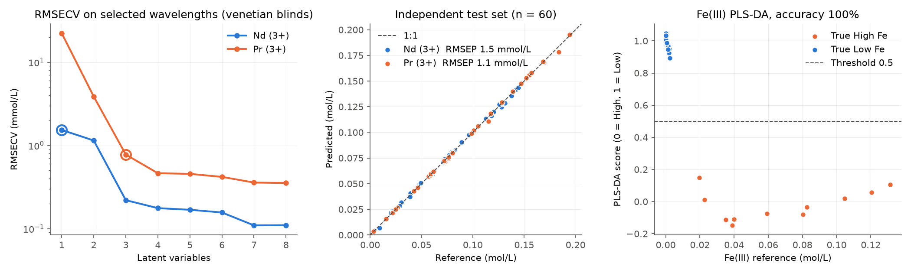

# ndfeb-uvvis

[](https://github.com/widijasd/ndfeb-uvvis-monitoring/actions/workflows/tests.yml)

Python pipeline for in-line UV-Vis monitoring of hydrometallurgical NdFeB magnet recycling.
It predicts Nd(III) and Pr(III) concentrations with PLS regression and classifies Fe(III)
as High or Low with PLS-DA, from absorbance spectra of chloride leachates.

The method is described in:

> Widijatmoko, S.D., Brooks, O.P., Walton, A. and Leeke, G.A. (2026). UV-Vis spectroscopy for
> monitoring the hydrometallurgical recycling of NdFeB magnets. *Journal of Hazardous Materials
> Advances*, 101540. https://doi.org/10.1016/j.hazadv.2026.101540

The models in the paper were built in MATLAB PLS_Toolbox. This package re-implements the same
preprocessing and model settings with open libraries (scikit-learn and
[chemotools](https://github.com/paucablop/chemotools)), so the models can be retrained, tested
and deployed from Python, for example inside an automated monitoring loop. It contains no
Eigenvector code.

## Data statement

The calibration data and trained models from the paper are still in use in an ongoing project
and are **not included**. The wavelength selection from the paper is included
(`nu.PUBLISHED_WAVELENGTHS`). Instead, `ndfeb_uvvis.simulate` generates synthetic spectra in the same
format (230 to 900 nm, 2 nm steps), so the whole pipeline runs end to end without them. The
`.gitignore` blocks data and model files (`*.csv`, `*.joblib`, `data/`) from being committed.

## Install

```bash
pip install git+https://github.com/widijasd/ndfeb-uvvis-monitoring
# or, for development
git clone https://github.com/widijasd/ndfeb-uvvis-monitoring
cd ndfeb-uvvis-monitoring
pip install -e ".[dev]"
```

## Quick start

```python
import ndfeb_uvvis as nu

# Synthetic calibration and independent test sets
cal_spectra, cal_conc, cal_labels = nu.simulate(250, seed=0)
test_spectra, test_conc, test_labels = nu.simulate(60, seed=1)

models = nu.fit_models(cal_spectra, cal_conc, cal_labels,
                       n_components={"Nd (3+)": 1, "Pr (3+)": 2},
                       selected_wavelengths=nu.PUBLISHED_WAVELENGTHS)
pred = nu.predict(test_spectra, models)
print(nu.validation_table(test_conc, pred, ["Nd (3+)", "Pr (3+)"]))

nu.save_models(models, "models.joblib")          # reload later with nu.predict(spectra, "models.joblib")
```

With your own data, `spectra` is a DataFrame with one row per sample and one column per
wavelength (for example `pd.read_csv(path, index_col=0)` on an instrument export), and
`concentrations` has one column per target in mol/L.

## Method

| Step | Setting |
|---|---|
| Range cut | 400 to 902 nm |
| Baseline | linear correction |
| Derivative | Savitzky-Golay, 1st derivative, window 7, 2nd-order polynomial |
| Scaling | mean centring |
| Regression | PLS (`scale=False`), optional per-target wavelength selection |
| Classification | PLS-DA on the same preprocessing, threshold 0.5 |
| Cross-validation | venetian blinds, 10 splits (`nu.VenetianBlinds`), matching PLS_Toolbox |

Each target uses its own wavelength selection (`nu.PUBLISHED_WAVELENGTHS`, the selection from
the paper) and a small number of latent variables, checked against the RMSECV curve
(`nu.cross_validate_components`):

| Target | Selected wavelengths (nm) | Points |
|---|---|---|
| Nd(III) | 496-510, 514-538, 560-598, 672-676, 684-690, 722-740, 744-766, 774-832, 842-882, 890-896 | 125 |
| Pr(III) | 436-454, 466-470, 480-488, 596-604 | 23 |

In the synthetic example, Nd uses 1 LV and Pr uses 2 LVs (Pr plus the Fe(III) tail that
overlaps its 436-454 nm region). Additional LVs lower RMSECV slightly further, mainly by
modelling the simulated wavelength shifts and minor band overlaps.

## Synthetic validation

`python examples/validate_synthetic.py` simulates independent calibration (n = 250) and test
(n = 60) sets, selects latent variables, fits the models and writes the results to `docs/`.



See [docs/synthetic_validation.md](docs/synthetic_validation.md) for the full figures of merit
(RMSECV, RMSEP, bias, SEP, R², mean relative error, Fe(III) classification accuracy).

These numbers describe performance on simulated data only. They show that the pipeline works
and is validated correctly; they are not the performance reported in the paper.

## Synthetic data model

Each spectrum is a Beer-Lambert sum (1 cm path length) of Nd(III), Pr(III), Fe(III) and Co(II)
contributions, with band positions and molar absorptivities at approximate, literature-typical
values. Measurement effects are added on top: white noise, per-sample baseline offset and slope,
small wavelength shifts, and detector saturation at 10 AU. All of these are adjustable through
`nu.Design` and `nu.Effects`, which makes the package useful for testing how
robust a model is to, for example, baseline drift or noise.

## Tests

```bash
pytest
```

Tests cover the simulator (layout, reproducibility, Beer-Lambert additivity), preprocessing,
model fitting and prediction on an independent test set, save/load round trips, input
validation, the venetian-blinds splitter and the figures of merit. They run on every push via
GitHub Actions.

## Project layout

```
src/ndfeb_uvvis/
    simulate.py     synthetic spectra
    model.py        preprocessing, cross-validation, fitting, save/load
    predict.py      apply a model bundle to new spectra
    metrics.py      RMSEP, bias, SEP, R², validation tables
examples/validate_synthetic.py
tests/
```

## Licence and citation

MIT licence. If you use this code, please cite the paper above (see `CITATION.cff`).
